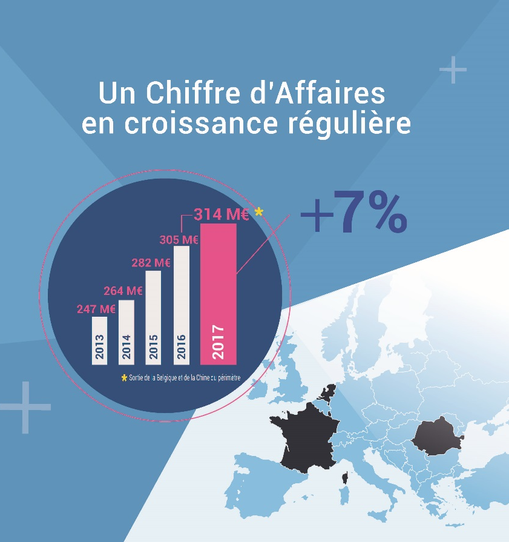
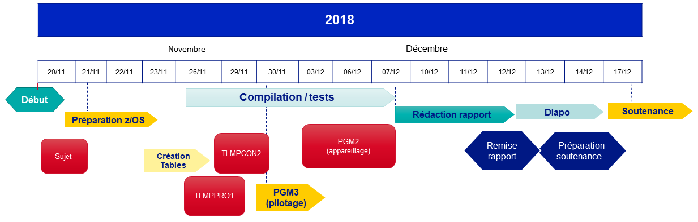

# Sujet
* Propagation des données de prospect
* DU Développeur Grands système

{width=98px}
{width=98px}
{width=123px}
{width=123px}
{width=98px}

# Plan
* OPEN
* Le projet
* Fonctionnement à aujourd'hui
* Solution envisagée
* Planning

# Open

:::::::::::::: {.columns}
::: {.column width="50%"}
{height=250px}
:::
::: {.column width="50%"}
{height=250px}
:::
::::::::::::::

::: notes

- je réprésente OPEN
- nous sommes 3700 collaborateurs
- domaine de compétences bancaire/finances

:::

# Projet
* Télémarketing
* 100 utilisateurs
* Prospection

# Aujourd'hui


# Solution

{height=250px}

# Planning



# Technique


::: notes

À QUOI ça sert ?

:::

# Résultat

```
                      \\\///
                     / _  _ \
                   (! (.)(.) !)
.----------------.OOOo--()--oOOO.----------------.
!                                                !
!            COMPTE-RENDU D'EXECUTION            !
!            -------------------------           !
!                                                !
! Programme :         TLMBPGM3                   !
! Developpeur :       ODO                        !
! Environnement :     BIZ1                       !
! Date d'execution :  11/12/2018 a 17H12         !
.----------------.oooO---------------------------.
                  (   )   Oooo.
                   \ (    (   )
                    \_)    ) /
                          (_/


Compteurs de lecture(s) du fichier de mise a jour
-------------------------------------------------

Nombre de lectures :                            20
Nombre d'ajout :                                 6
Nombre de mise a jour :                          8
Nombre de lignes supprimees :                    2
Nombre de lignes rejetees :                      4
-------------------------------------------------
Nombre de lignes totales :                      16


.------------------------------------------------.
!     F I N   D E   C O M P T E  -  R E N D U    !
.------------------------------------------------.
```

# Retours
* Programme qui met à jour les données journalières
* Signature contrat demain matin

# {data-background-image="cat-phone.jpg"}

* Questions ?

:::notes

Remerciements, Question

:::
